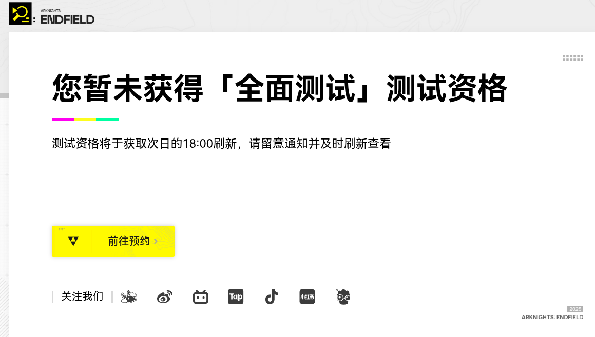

# Endfield Tool —《明日方舟：终末地》生产计算工具

[English](./README.md)

## 项目简介

Endfield Tool 是一个面向《明日方舟：终末地》的生产规划和设施计算工具。  
它帮助玩家规划和优化资源生产：建造设施、制作物品、管理配方，并计算所需原材料及生产时间。

## 主要功能
- 一键查看物品与配方：浏览游戏中可制作物品以及对应的输入/输出配方与制作时间。
- 生产目标与计划：添加目标产量（目标物品与数量），工具会自动展开所需配方链并计算原材料总量。
- 设施与产能估算：展示需要使用到的设施类型与建议数量，帮助你安排建造与资源分配。
- 实时交互：调整目标数量、切换配方或设施，页面会即时重新计算并显示结果。
- 多语言支持：界面包含中/英等本地化文本（基于项目内 i18n 实现）。

## 贡献

欢迎贡献！如果发现 bug 或有改进建议，请随时提交 issue 或 pull request。

## 社群

欢迎加入我们的社群讨论游戏攻略、反馈问题或分享使用心得：

## 许可证

MIT

---

## 数据来源 & 免责声明

- **数据来源**：所有物品、配方和设施数据均取自 [endfield.wiki.gg](https://endfield.wiki.gg)。
- **准确性说明**：本人并无游戏测试资格。工具输出仅基于维基数据，**仅供参考**，请理性使用。

